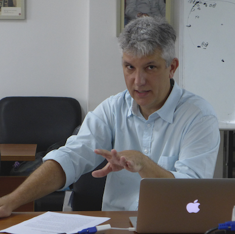

# About

John Laudun is Professor of English at the University of Louisiana, where his research focuses on computational models of discourse, especially narratives, and how they cascade through socio-cultural networks both online and off. In addition to his work on folk narrative and the intellectual history of folklore studies, he has published an ethnographic study, _The Amazing Crawfish Boat_ (University Press of Mississippi, 2016), that uses actor-network theory to understand creativity and tradition. His work has appeared in a variety of academic journals and edited volumes, as well as cited in newspaper and documentaries. He has been a Jacob K. Javits Fellow, a MacArthur Scholar, a fellow at the EVIA Digital Archive, a fellow with the  Institute on Network Studies in the Humanities, and a senior researcher at UCLA's Institute for Pure and Applied Mathematics. His work has been funded by the Grammy Foundation, the Louisiana Board of Regents, the Andrew Mellon Foundation, the National Endowment for the Humanities, and the National Science Foundation.

 

Giving a talk at the Chinese Academy of Social Sciences

## Contact

**John Laudun**, Department of English, University of Louisiana, Lafayette, LA 70504, 337-482-6906, laudun at louisiana dot edu

Other places to find me:

[Blog](http://johnlaudun.org)  
[Teaching](https://johnlaudun.github.io/teaching)  
[Twitter](https://twitter.com/johnlaudun/)  
[GitHub](https://github.com/johnlaudun/)  

## Colophon

This site is built using and is itself open source. It is served thanks to the functionality of [GitHub pages][]. It is built with the Python library [mkdocs][], which is so much more than you see here. The CSS is a modified (simplified really) version of the mkdocs theme [Alabaster][]. The type used is Alegraya, designed by Juan Pablo del Peral and released under the [SIL Open Font License][]. The entirety of the site is available for viewing, and for download, at its [GitHub repo][]. View, and/or use, the code at your own risk -- I am still learning mkdocs and [Sphinx][].

[GitHub pages]: https://pages.github.com
[mkdocs]: https://mkdocs.org
[Alabaster]: https://github.com/notpushkin/mkdocs-alabaster
[SIL Open Font License]: http://scripts.sil.org/cms/scripts/page.php?site_id=nrsi&id=OFL
[GitHub repo]:
[Sphinx]: https://www.sphinx-doc.org/en/master/index.html
